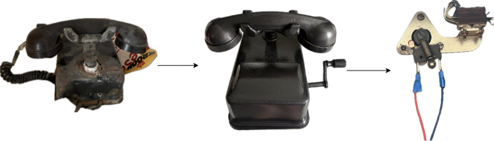
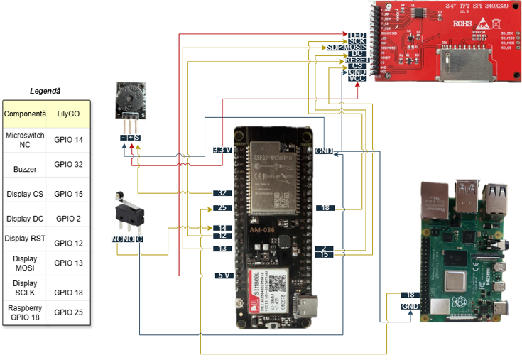

# Hybrid Emergency Telephone for the Elderly

## Overview
This project transforms a vintage telephone terminal into a smart, hybrid emergency alerting system dedicated to elderly individuals. By eliminating modern technological barriers, the system provides a completely familiar interface (lifting the handset) while running advanced IoT capabilities and geolocation protocols in the background. 

  

## Key Features
* **Hybrid Triggering Mechanism:** The emergency alert can be activated mechanically by lifting the phone receiver or vocally via keyword recognition ("AJUTOR").
* **GSM Geolocation (Cell-ID):** Estimates the user's location using 2G GSM network parameters (MCC, MNC, LAC, CID) to ensure functionality even indoors.
* **Google Geolocation API Integration:** Converts raw cellular tower data into precise geographic coordinates and an accuracy radius.
* **Instant Telegram Notifications:** Dispatches automated emergency alerts containing the network parameters and a live Google Maps link via the Telegram Bot API.
* **Automated GSM Call:** Automatically dials a predefined emergency contact to establish a safety voice connection.
* **Visual & Acoustic Feedback:** Employs an active piezoelectric buzzer to signal key moments in real-time (distinct alerts upon emergency triggering, simulating standard dialing and ringing tones during the call, and a final confirmation beep when the process concludes). A TFT display simultaneously shows the system's live status.

  

  

## Hardware Stack
* **Core Microcontroller & Modem:** LilyGO T-Call development board integrating the ESP32-WROVER-B and SIM800L GSM module.
* **Voice Processing Subsystem:** Raspberry Pi 4 Model B paired with an Adafruit PyBadge and a microphone for local voice command processing.
* **Power & Connectivity:** 1350 mAh Li-Po battery as a backup power source and an external 2 dBi GSM antenna for stable connectivity.
* **Peripherals:** Restored vintage telephone casing, mechanical microswitch for the handset, ST7789V TFT display, and an active piezoelectric buzzer.

  

## Software & Technologies
* **C/C++ (Arduino IDE)** for ESP32 firmware development and hardware state management.
* **AT Commands** for asynchronous serial communication with the cellular modem.
* **HTTPS & JSON** for secure data formatting and transmission to Google Cloud services.
* **MQTT** (via Telegram Bot API) for fast, real-time alert dispatching.
